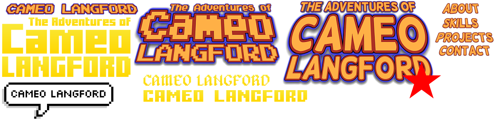
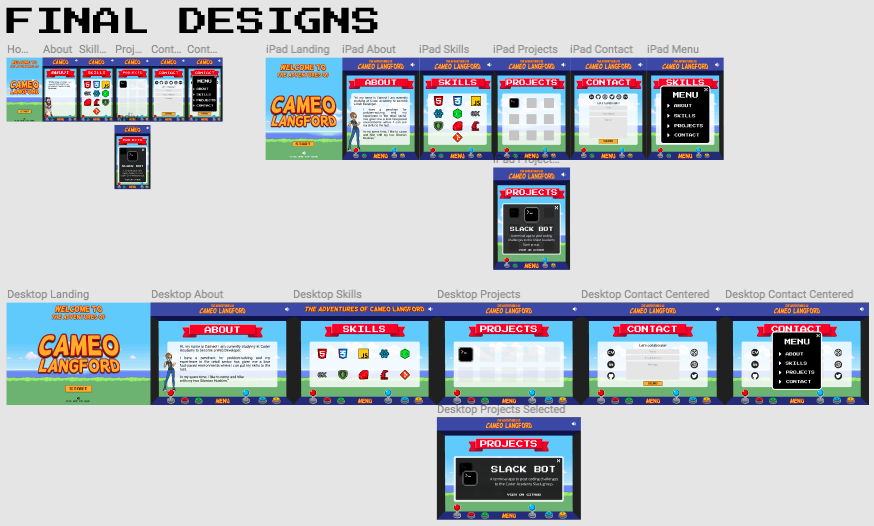
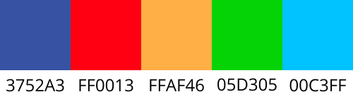
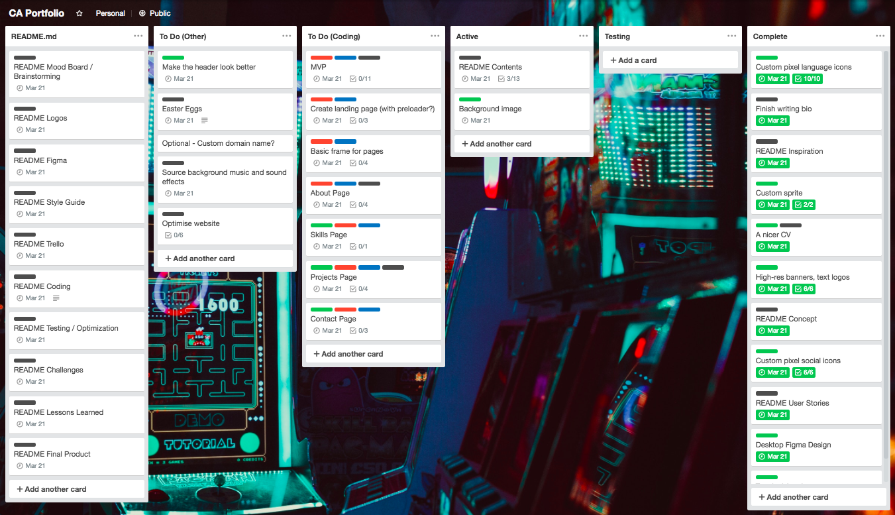

# Cameo's Portfolio Website

- [Concept](#concept)
- [User Stories](#user-stories)
- [Inspiration](#inspiration)
- [Mood Board & Brainstorming](#mood-board-brainstorming)
- [Logos](#logos)
- [Figma](#figma)
- [Style Guide](#style-guide)
- [Trello](#trello)
- [Coding](#coding)
- [Technical Challenges](#technical-challenges)
- [Lessons Learned](#lessons-learned)
- [Roadmap](#roadmap)
- [Final Product](#final-product)

## Concept

The aim of this project is to create a portfolio website to showcase my projects to potential employers or other people in the tech industry. My plan for the website is to continually update and refactor it throughout my career to make sure it is current and references my best work.

---
## User Stories
#### General
- As a user the website loads quickly on all of my devices
- As a user I can easily scroll through all of the content
- As a user I can find the menu and use it to navigate the website
- As a user the website works in all of my browsers (desktop and mobile)
- As a user with disabilities the website meets all accessability standards
- As a user the creator has kept heuristics in mind (consistency, minimal steps etc.)
#### Future Employers
- As a future employer I can easily find Cameo's past projects with links to GitHub or a live product
- As a future employer I can easily find the languages that Cameo is proficient in
- As a future employer I can easily find links to relevant website accounts (Github, LinkedIn, Codepen etc.)
- As a future employer I can see Cameo's resume
- As a future employer I can see information about Cameo to see if she would be a good culture fit for my company
- As a future employer I can contact Cameo for further information
---
## Inspiration
I am very drawn to minimalist web design, which goes completely against the website that I ended up with. I had originally planned to create a very minimalist, nature themed website. Unfortunately I'm going through a phase at the moment where I love video games/arcade games and the related aesthetic. I was torn between the two choices so I made a [Pinterest board](https://www.pinterest.com.au/hello9327/portfolio-inspo/) for both a nature-based theme and a gaming-based theme. Once I put all of the images together in Figma I very quickly decided on the gaming theme.

Once I had decided on a gaming theme, I came up with the idea of making the webiste look like an arcade game with cabinet frame around the outside. While it was a good idea, I realised that making a pixellated frame would either make my website too image heavy (by having an image used as the frame) or make it very slow to load (by using CSS to create the pixels). I scrapped that idea and decided to make a 90's inspired arcade game console. The inner graphics of the website were heavily influenced by my childhood playing Sega Mega Drive games such as Altered Beast, Alex Kidd, Aladdin, Lion King, Streets of Rage and Mortal Kombat.

---
## Mood Board & Brainstorming

---
## Logos

Famous video game logos

Although many games are instantly recognisable by their logos, I chose to use a text logo instead of a symbol. I went through a few different choices and found some game font generators online. As you can see below, I had a few different ideas and finally settled on the style shown with the red star.

---
## Figma

### [My Figma Canvas](https://www.figma.com/file/IhYxPgfZHupUI4NxbapMw9wl/Portfolio)

I never really plan out a website before I begin coding it. I normally get a general idea of what it will look like in my head and then go from there, so I had a love/hate relationship with Figma. I hated it at the start because at least half of the time I spent on the project was taken up by Figma, designing various layouts, moving objects around to get them just right, making different layouts for different devices. But in the end I loved Figma because of all of this - it allowed me to completely map out my website before even writing a line of code. It made the whole process much easier and much faster than if I had've just gone straight to coding and my website wouldn't look anything like it does now if I hadn't have used it.

Something that was a great help during the development of the website was using the Figma Mirror app on mobile and the Figma Mirror website on my laptop. The app allowed me to see what my mobile designs would look like on an actual device, and the website allowed me to see what my mockup would look like as an actual website.

A lot of inspiration, links, comments and more went into my Figma board (as well as some poor design choices), but my final decisions are below.

---
## Style Guide
### Fonts
[Helsinki](https://www.dafont.com/helsinki.font) font for titles/logos with red outline and drop shadow

[Press Start 2P](https://fonts.google.com/specimen/Press+Start+2P) font for headings, buttons and emphasis

[Open Sans](https://fonts.google.com/specimen/Open+Sans) font for body text

### Main Colour Palette

---
## Trello 

### [My Trello Board](https://trello.com/b/EvTQgzk8/ca-portfolio) 

Trello helped me to organise all of the various tasks that needed to be done to create the portfolio - my website would've been in shambles without it. I was able to separate my tasks by coding related, other tasks, which tasks needed content created etc. and allowed me to prioritise which tasks needed to be completed first. The perfectionist in me let out a sigh of relief every time I moved a card to the 'Complete' list. I have a tendancy to go back and revise things or constantly make minor changes, so putting a task in the 'Complete' list allowed me to mentally check it off and forget about it.

---
## Coding

It took me a lot longer to get around to coding this project than I had anticipated. We were given the assessment on a Thursday and I had the Figma completed by Friday afternoon. My plan had been to create all of the custom pixel graphics on Saturday and begin coding the website on Sunday. It took me both Saturday and Sunday to get all of the graphics done so mentally I felt like I was falling behind, even though most of my peers were at the same stage that I was. By Monday afternoon I was still playing catchup with the README.md file (why won't I learn to document as I go?), leaving me with 48 hours and a few late nights to put my coding skills to the test and get the website deployed.

In that time I produced a mobile-first MVP that is quite close to my initial design. I'm very pleased with what I've been able to make, although it would have been much easier and faster if we were able to implement Javascript and other libraries/frameworks.

---
## Technical Challenges
Some of the technical challenges I faced include (but definitely aren't limited to):
- Using a horizontal scroller that would move when you scroll downwards - it would transform my items
- Whitespace: nowrap; issues with adding content to box
- Using Flexbox to help with horizontal scrolling

- Using divs for cabinet frame didn't work well - had to create images instead
- Forcing flexbox to work like CSS Grid because I forgot about grid
- Trying to figure out grid because I couldn't get flexbox to work properly
- Images not resizing in grid / trying to resize breaks grid - had to make different sized images for each media query
- Use JS to make exit button on menu work

---
## Lessons Learned

**MOBILE FIRST.** I began coding my portfolio and had a (fairly decent) MVP made before I remembered that it needed to be responsive - needless to say, it did not resize well. I ended up starting again so I could develop the mobile version first.

**ASK FOR HELP.** There were times where I sat in front of my laptop for an hour trying to figure out an issue that was solved in a few minutes once I asked somebody for help. It was also great to be able to bounce ideas off of and rubber duck debug with other people. 

**PLANNING IS GOOD, BUT SO IS CODING.** While I'm so glad that I made an in-depth plan for the website, in hindsight I spent more time making it perfect when I could've been working on the code.

---

## Roadmap

- Using JS to help with Projects popup functionality
- Add directional arrows to indicate side-scrolling function

---
## Final Product

The final product can be found here:

